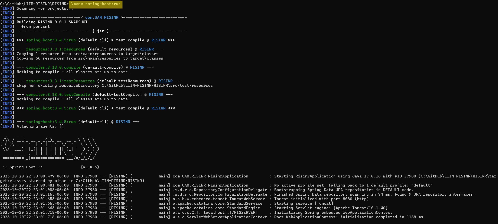
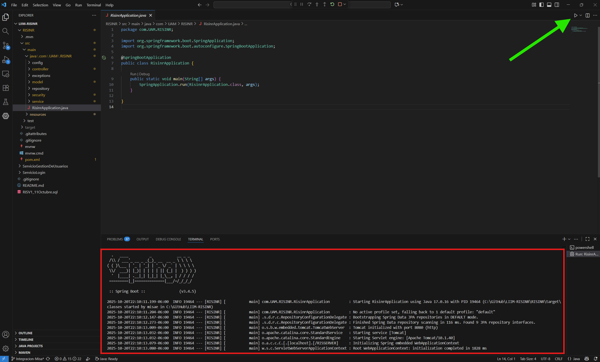
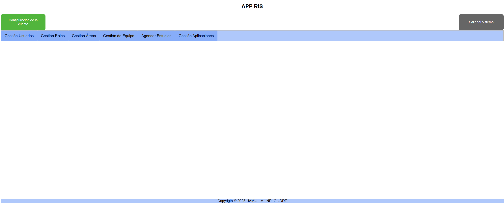

# RIS-INR

Sistema de Información Radiológico (RIS) desarrollado para el Instituto Nacional de Rehabilitación (INR), como proyecto de integración de la UAM-Iztapalapa a través del Laboratorio de Investigación en Informática Médica (LIIM).

---

## Prerequisitos

| Herramienta | Versión mínima |
|---|---|
| Java JDK | 17 |
| Maven | 3.9+ (o usar el Maven Wrapper incluido `mvnw`) |
| MariaDB | 11.5+ |

---

## Configuración de la base de datos

### 1. Crear el usuario de la aplicación

Conéctate a MariaDB como administrador y ejecuta:

```sql
CREATE USER 'RIS_INR'@'localhost' IDENTIFIED BY 'ris2025#$';
GRANT ALL PRIVILEGES ON RISV1.* TO 'RIS_INR'@'localhost';
FLUSH PRIVILEGES;
```

### 2. Crear la base de datos y cargar el esquema

```sql
CREATE DATABASE RISV1 CHARACTER SET utf8mb4 COLLATE utf8mb4_uca1400_ai_ci;
```

Luego importa el script SQL incluido en la raíz del repositorio:

```bash
mysql -u RIS_INR -p RISV1 < RISV1_20260315.sql
```

> El script incluye tanto la estructura de tablas como los datos de prueba.

---

## Configuración de la aplicación

El archivo de configuración se encuentra en:

```
RISINR/src/main/resources/application.properties
```

Los valores por defecto ya apuntan a la BD local configurada en los pasos anteriores. Si tu entorno es diferente, ajusta:

```properties
spring.datasource.url=jdbc:mariadb://localhost:3306/RISV1
spring.datasource.username=RIS_INR
spring.datasource.password=ris2025#$
```

---

## Cómo correr el proyecto

Desde la carpeta `RISINR/`:

```bash
./mvnw spring-boot:run
```

La aplicación estará disponible en:

```
http://localhost:8080/RISSERVER
```

---

## Usuario de prueba

Al importar el script SQL ya existe un usuario con todos los roles disponibles:

| Campo | Valor |
|---|---|
| Usuario | `LIIM` |
| Contraseña | `holaMundo` |

---

## Documentación Javadoc

Para generar el sitio HTML de documentación del código:

```bash
./mvnw javadoc:javadoc -Ddoclint=none
```

El sitio se genera en:

```
RISINR/target/reports/apidocs/index.html
```

---

## Autores

- **Pedro Misael Rodríguez Jiménez**
- **María de Jesús Rebolledo Bustillo**

**Líder del proyecto:** Alfonso Martínez Martínez
# Sistema de Información Radiológica del Instituto Nacional de Rehanlilitación
Proyecto de integración del sistema RIS-INR, con los servicios y aplicaciones trabajados previamente con alumnos de la UAM-Iztapalapa en el Laboratorio de Investigación en Informática Médica (LIIM)
## 🔩 Requisitos y dependencias
- Java 17.0 +
- MariaDB 11.5 +
## ▶️ Uso (CLI)
Restaurar base de datos con las siguientes propiedades:
  - Nombre BD: RISV1
  - Nombre Usuario (Todos los permisos a RISV1): RIS_INR
  - password de usuario: ris2025#$
    
Clonamos el repositorio en el directorio deseado
``` bash
git clone https://github.com/almm62/LIIM-RISINR
```
Accedemos a la carpeta del proyecto
- Linux
``` bash
cd LIIM-RISINR/RISINR
```
- Windows (cmd)
``` bash
cd LIIM-RISINR\RISINR
```
Ejecutamos el proyecto
- Linux
``` bash
./mvnw spring-boot:run
```
- Windows
``` bash
.\mvnw spring-boot:run
```
### Servidor corriendo

   
## 🔍 Notas y consideraciones
- Si se desea trabajar con Visual Studio Code, es recomendable descargar las siguientes extensiones:
  - Extension Pack for Java | incluye:
    - 📦 Language Support for Java™ by Red Hat
    - 📦 Debugger for Java
    - 📦 Test Runner for Java
    - 📦 Maven for Java
    - 📦 Gradle for Java
    - 📦 Project Manager for Java
    - 📦 Visual Studio IntelliCode
  - Spring Boot Extension Pack | incluye:
    - 📦 Spring Boot Tools
    - 📦 Spring Initializr Java Support
    - 📦 Spring Boot Dashboard
### Ejecución desde VSCode



## Acceda a la Aplicación desde [http://localhost:8080/RISSERVER/login.html](http://localhost:8080/RISSERVER/login.html)
E inicie Sesión
- Actualmente los perfiles que están habilitados para prueba son:
  - Administrador
  - Jefe de Servicio


### Perfil de Administrador


### Perfil de Jefe de Servicio

